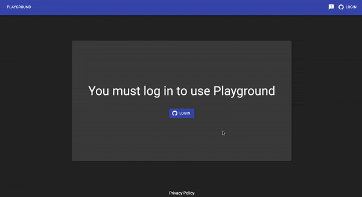

 

# Substrate playground

A hosted website that enables the user to navigate [Substrate](https://github.com/paritytech/substrate) runtimes, modify them and run remotely accessible chain. In a couple seconds!

  

Playground allows end-user to spin up a substrate based development environment in seconds. A full machine with terminal is then available from a web browser, ready to launch a chain and remotely access it.
Playground templates can be [created and maintained](docs/extending/custom-template.md) by 3rd parties.

## Trying it out

Access playground [here](docs.substrate.io/playground/).

## Deployment

Playground is a set of containerized apps deployed on a kubernetes cluster. Fear not, it's quite simple to [deploy](docs/operating/deployment.md) it!
