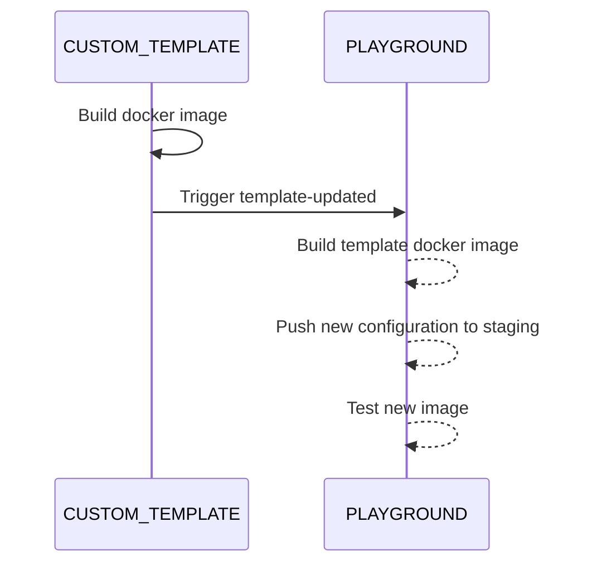

External users can provide and maintain templates used by the playground.

To create a template the following steps are mandatory:

* create a basic Dockerfile (in `.devcontainer/Dockerfile`) extending `paritytech/substrate-playground-template-base`
* create `.devcontainer/devcontainer.json` (find an example [here](https://github.com/substrate-developer-hub/substrate-node-template/blob/master/.devcontainer/devcontainer.json))
* create a Github worflow that build this image then dispatches an event to `substrate-playground` (find an example [here](https://github.com/substrate-developer-hub/substrate-node-template/blob/master/.github/workflows/build-push-template.yml))

Additionally there are a number of standard VSCode configuration files that will be leveraged by the playground:

* .vscode/settings.json (see https://code.visualstudio.com/docs/getstarted/settings)
* .vscode/launch.json
* .vscode/tasks.json
* .vscode/snippets.code-snippets

An example of adding support to an external repository can be found [here](https://github.com/substrate-developer-hub/substrate-node-template/).

After the associated Github workflow in [substrate-playground](https://github.com/paritytech/substrate-playground) is triggered, playground will use the newly built image. 

# Github workflow

A template workflow can be found [here](https://github.com/paritytech/substrate-playground/blob/develop/.github/workflow-templates/cd-template.yml).

This workflow will:

* create and publish a standalone Docker image based on a local Dockerfile
* update `.devcontainer/devcontainer.json` to use this new image
* commit changes
* trigger `template-updated` on `paritytech/substrate-playground`

This event triggers the following actions in `paritytech/substrate-playground`:

* create and publish a [composite docker image](https://github.com/paritytech/substrate-playground/blob/develop/templates/Dockerfile.template) from the new template one and latest [base one](https://github.com/paritytech/substrate-playground/blob/develop/templates/Dockerfile.base)
* update [template image id](https://github.com/paritytech/substrate-playground/tree/develop/conf/k8s/overlays/staging/templates)
* commit changes

Changes to the configuration file are finally [continuously deployed](https://github.com/paritytech/substrate-playground/blob/develop/.github/workflows/cd-templates.yml) to the staging playground environment as kubernetes ConfigMap.

Once live, images are tested and rollbacked if errors are detected.

## Github secrets

The following secrets must be defined:

`DOCKER_USERNAME` and `DOCKER_PASSWORD` to push the image to dockerhub (values will depend on the chosen docker image org)
`REPO_ACCESS_TOKEN` a token with `public_repo` or repo scope