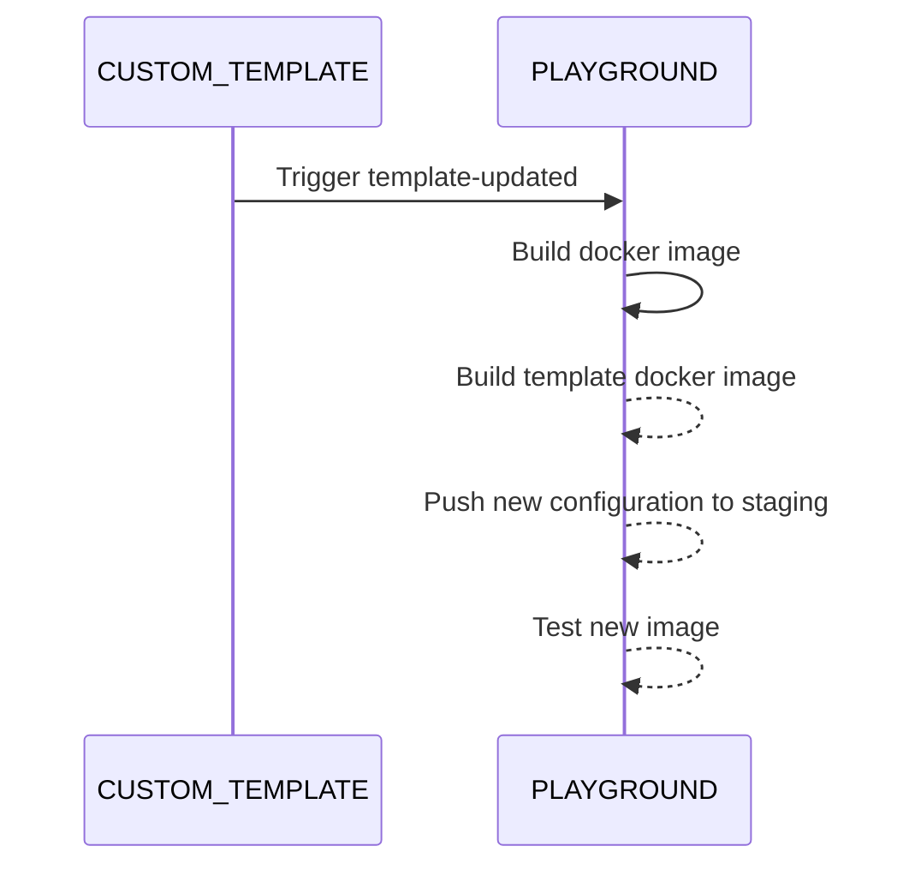

External users can provide and maintain templates used by the playground.

To create a template the following steps are mandatory:

* create `.devcontainer/devcontainer.json` (find an example [here](https://github.com/paritytech/substrate-playground/blob/develop/.github/workflow-templates/devcontainer.json))
* create a Github worflow that build this image then dispatches an event to `substrate-playground` (find an example [here](https://github.com/paritytech/substrate-playground/blob/develop/.github/workflow-templates/cd-template.yml))

Additionally there are a number of standard VSCode configuration files that will be leveraged by the playground:

* .vscode/settings.json (see https://code.visualstudio.com/docs/getstarted/settings)
* .vscode/launch.json
* .vscode/tasks.json
* .vscode/snippets.code-snippets

After the associated Github [workflow](https://github.com/paritytech/substrate-playground/blob/develop/.github/workflows/event-template-updated.yml) in substrate-playground is triggered, playground will use the newly built image. 

# Github workflow

A template workflow can be found [here](https://github.com/paritytech/substrate-playground/blob/develop/.github/workflow-templates/cd-template.yml).

`client_payload` must define `id` pointing to one of the existing [templates](https://github.com/paritytech/substrate-playground/blob/develop/conf/k8s/overlays/staging/).
It can also define a `ref` (branch/tag/commit used to build, defaults to _master_) and a `dockerFile` location (default to _.devcontainer/Dockerfile_)

This workflow will trigger the [_template-updated_ workflow](https://github.com/paritytech/substrate-playground/blob/develop/.github/workflows/event-template-updated.yml) on [substrate-playground](https://github.com/paritytech/substrate-playground/), including the following actions:

* create and publish a [composite docker image](https://github.com/paritytech/substrate-playground/blob/develop/templates/Dockerfile.template) from the new template one and latest [base one](https://github.com/paritytech/substrate-playground/blob/develop/templates/Dockerfile.base)
* update [template image id](https://github.com/paritytech/substrate-playground/tree/develop/conf/k8s/overlays/staging/templates)
* commit changes

Changes to the configuration file are finally [continuously deployed](https://github.com/paritytech/substrate-playground/blob/develop/.github/workflows/cd-templates.yml) to the staging playground environment as kubernetes ConfigMap.

Once live, images are tested and rollbacked if errors are detected.

## Github secrets

The following secrets must be defined:

`REPO_ACCESS_TOKEN` a token with `public_repo` or repo scope
