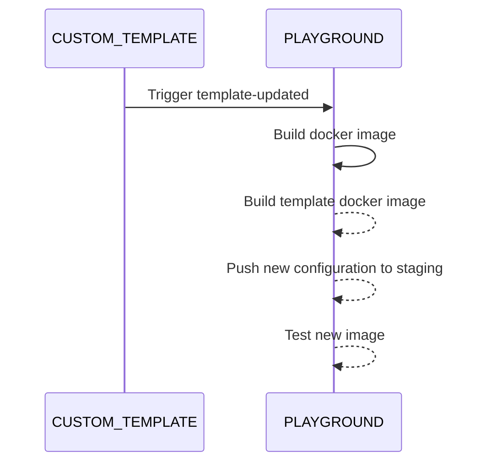

External users can provide and maintain templates used by the playground.

To create a template the following steps are mandatory:

* create `.devcontainer/devcontainer.json` (find an example [here](https://github.com/paritytech/substrate-playground/blob/develop/.github/workflow-templates/devcontainer.json))
* create a Github worflow that build this image then dispatches an event to `substrate-playground` (find an example [here](https://github.com/paritytech/substrate-playground/blob/develop/.github/workflow-templates/cd-template.yml))

Additionally there are a number of standard VSCode configuration files that will be leveraged by the playground:

* .vscode/settings.json (see https://code.visualstudio.com/docs/getstarted/settings)
* .vscode/launch.json
* .vscode/tasks.json
* .vscode/snippets.code-snippets

After the associated Github [workflow](https://github.com/paritytech/substrate-playground/blob/develop/.github/workflows/event-template-updated.yml) in substrate-playground is triggered, playground will use the newly built image. 

## Custom commands

Replace ENV, USER, HOST (via ${containerEnv:VAR_NAME})

`preCreateCommand` is executed 

`preContainerStartCommand` via Init Containers, can write files

`postContainerStartCommand` via Container lifecycle hooks, run inside the container

`preContainerStopCommand` via Container lifecycle hooks, run inside the container

Container killed after `terminationGracePeriodSeconds`

https://www.linkedin.com/pulse/kubernetes-deep-dive-part-1-init-containers-lifecycle-chauthaiwale/

https://kubernetes.io/fr/docs/concepts/containers/container-lifecycle-hooks/

`preStartCommand`

`postStartCommand` (or `postAttachCommand`) are executed 

`menuActions` 

TODO: support string and array syntax
TODO: add postCreateCommand

Potential hooks:
* when image is created (`preCreateCommand`)
* when user deploy a template
** server side
** before theia loads
** after theia is loaded, headless or in a shell

## Github workflow

A template workflow can be found [here](https://github.com/paritytech/substrate-playground/blob/develop/.github/workflow-templates/cd-template.yml).

`client_payload` must define `id` pointing to one of the existing [templates](https://github.com/paritytech/substrate-playground/blob/develop/conf/k8s/overlays/staging/).
It can also define a `ref` (branch/tag/commit used to build, defaults to _master_) and a `dockerFile` location (default to _.devcontainer/Dockerfile_)

This workflow will trigger the [_template-updated_ workflow](https://github.com/paritytech/substrate-playground/blob/develop/.github/workflows/event-template-updated.yml) on [substrate-playground](https://github.com/paritytech/substrate-playground/), including the following actions:

* create and publish a [composite docker image](https://github.com/paritytech/substrate-playground/blob/develop/templates/Dockerfile.template) from the new template one and latest [base one](https://github.com/paritytech/substrate-playground/blob/develop/templates/Dockerfile.base)
* update [template image id](https://github.com/paritytech/substrate-playground/tree/develop/conf/k8s/overlays/staging/templates)
* commit changes

Changes to the configuration file are finally [continuously deployed](https://github.com/paritytech/substrate-playground/blob/develop/.github/workflows/cd-templates.yml) to the staging playground environment as kubernetes ConfigMap.

Once live, images are tested and rollbacked if errors are detected.

### Github secrets

The following secrets must be defined:

`REPO_ACCESS_TOKEN` a token with `public_repo` or repo scope

## Deployment workflow

A user creates a session by selecting a template. Extra arguments can be provided a deployment time (deployment specific: duration, .. or template specific: version)
The correct image name is retrieved, a Pod descriptor created (with conf as annotations), and associated Service (exporting the expected ports), and TODO a nginx Ingress exposing TCP (UPD?) ports, and a persistent workspace (or existing one, matched by template or repo). This workspace will receive a clone of the GIT repo, and a copy of pre-compiled repo if this is a template. Changes are kept arround. If USER has a matching repo fork, it will be configured accordingly. Git creds allows to push remote changes.
Based on user, add the right node metadata to select the right node.

https://stackoverflow.com/questions/53683594/how-to-clone-a-private-git-repository-into-a-kubernetes-pod-using-ssh-keys-in-se

Configuration:
* global env (ConfigMap)
* per template tag
* per user tag

All can be configured in Admin tab and have default values.

Allow to configure e.g. IDE, session duration, custom node pool, ..

TODO allow to github push with user
If a user fork is detected, offer to switch or add remote.
If not, offer to fork first.
* git remote add danforbes https://github.com/danforbes/substrate-node-template.git
* git fetch danforbes && git checkout danforbes/master

When a template is created:
* start a docker with theia
* clone GH
* run commands
* persist VolumeClaim

When a template is started
* locate the VolumeClaim, clone it (https://medium.com/@tyagi3192/persistent-volume-claim-cloning-in-kubernetes-9ea1101442a2, https://kubernetes.io/blog/2019/06/21/introducing-volume-cloning-alpha-for-kubernetes/)
* start a container with the new VolumeClaim

When a repo is started
* create a VolumeClaim with github clone
* start a container with the new VolumeClaim

https://computingforgeeks.com/perform-git-clone-in-kubernetes-pod-deployment/
https://gist.github.com/tallclair/849601a16cebeee581ef2be50c351841

TODO VolumeClaim and local usage? (CLI, devcontainer.json)
For CLI: copy local files, when done re-upload. Require starting an instance
kubectl cp POD-NAME:/data data/
* https://github.com/kubernetes-client/javascript/blob/master/src/cp.ts
* https://stackoverflow.com/questions/56761028/how-to-copy-files-between-pods-or-execute-in-a-pod
* https://kubernetes.io/docs/reference/generated/kubectl/kubectl-commands#cp
Or: mount fs via ssh
* https://linuxize.com/post/how-to-use-sshfs-to-mount-remote-directories-over-ssh/
* https://github.com/osxfuse/osxfuse/wiki/SSHFS
* https://www.expandrive.com/sshfs-mac/
* https://doc.ubuntu-fr.org/sshfs
* https://www.digitalocean.com/community/tutorials/how-to-use-sshfs-to-mount-remote-file-systems-over-ssh

Keep a pod indefinitely: command: tail -f /dev/null

TODO security at theia level, grafana (only correct user can access)

Prevent concurrent usage from CLI, Remote in VSCode and web

    /// Share a single process namespace between all of the containers in a pod. When this is set containers will be able to view and signal processes from other containers in the same pod, and the first process in each container will not be assigned PID 1. HostPID and ShareProcessNamespace cannot both be set. Optional: Default to false. This field is beta-level and may be disabled with the PodShareProcessNamespace feature.
    pub share_process_namespace: Option<bool>,
